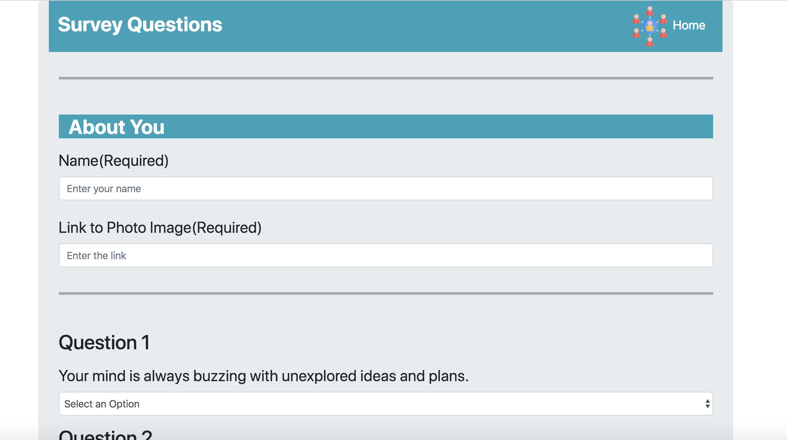

# EmployeeFinder

## Descrition
---
This application matches with another employee based on the user's survey. Answer all questions and then pops up the matched employee.

## Structure of Files
---

publics folder
* home.html: The home page of survey site.
* survey.html: The survey page where the user uses.
* style.css: The style sheet for the html page.
* survey.js: Javascript on the client side.

routing folder
* apiRoute.js: HTTP call javescript
* htmlRoutes.js: Two routes to display home.html and survey.html.
* matchedEmployee.js: Check the matched employee for the user.

Main
* server.js: Used in class: `express` and `path` to start a server.

Data
* employees.js: It contains the initial data(array of object).

***How to use***

---
1. Go to ([Employee Finder Site](https://thawing-ocean-68026.herokuapp.com/ )) to access the Employee Finder site.

2. Click on Go to Survey button to go to [go to the survey page](https://thawing-ocean-68026.herokuapp.com/survey).

3. Answer all question and click on submit, and then the pop up windwo shows up for the matched employee.

### Author
---

Makiko Vaughan(makiko.vaughan@gmail.com)